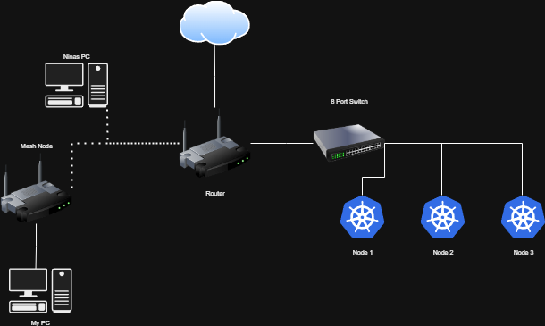
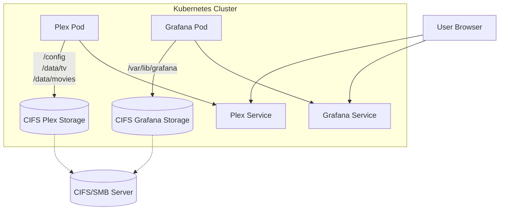

# Homelab Project

My attempt to become more organised with my horribly unorganised homelab that is a mix of containers, VMs and Proxmox. 

## Next steps

## Diagrams
Planned setup

Planned interactions
